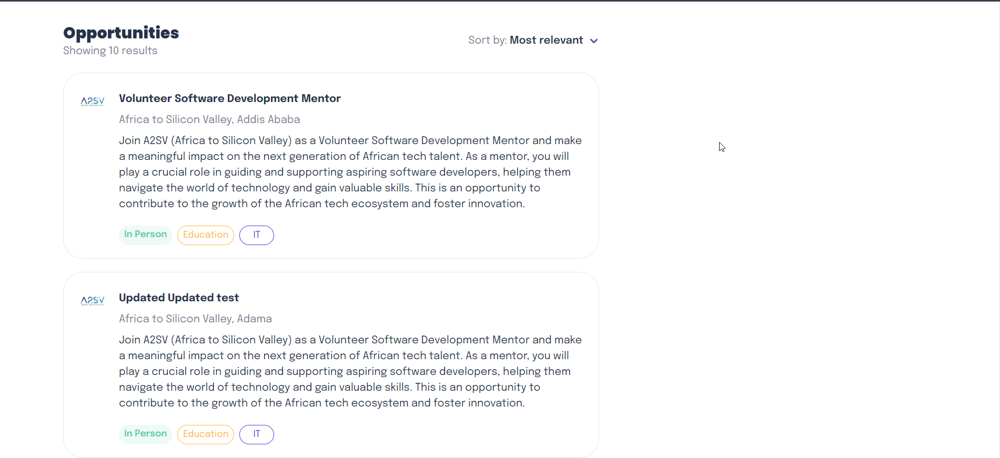
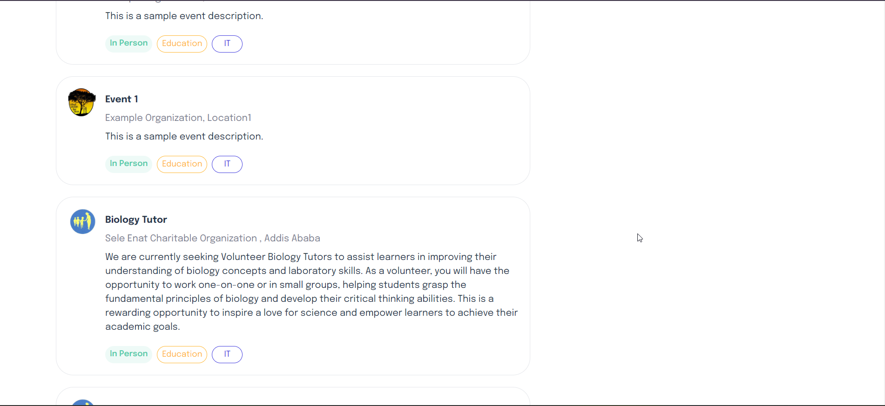
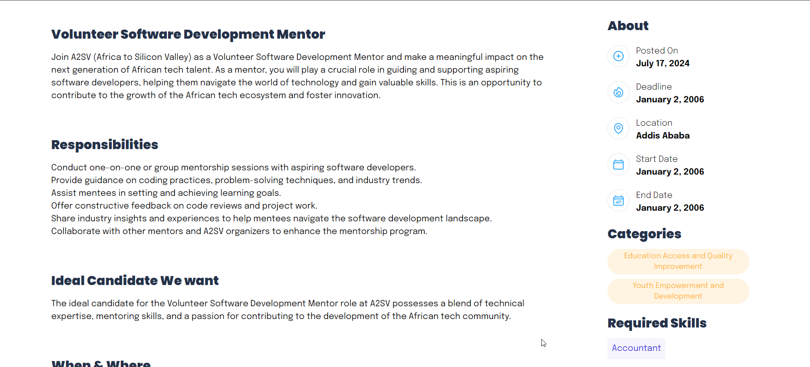
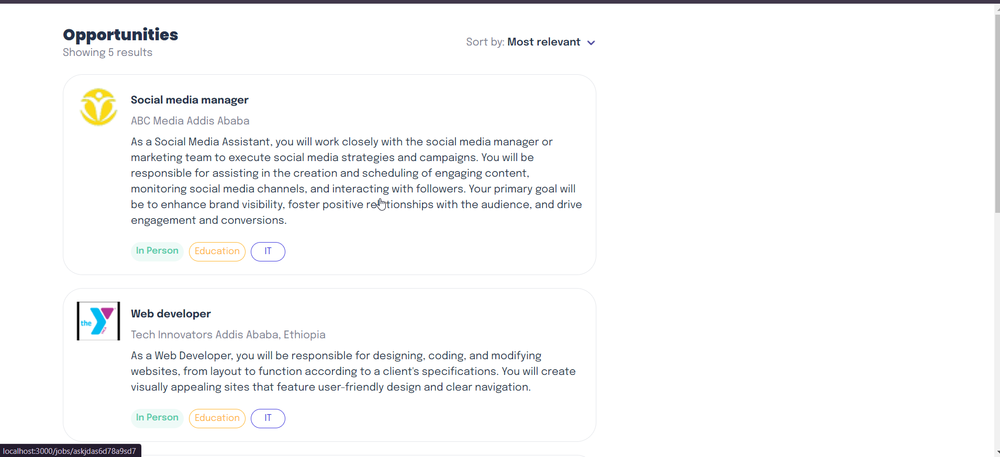
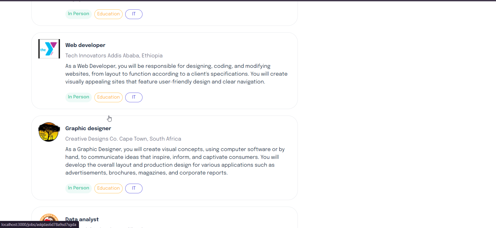

## HireHub

# A job listing application for any kind of jobs

## Task Six Screenshots

#### Fetching data from Akil API endpoints using fetch API

# Job Listing home page

# Job Listing home page scrolled down

# Specific page/job route

# Loading Page Animation

## Screenshots From Task 6 while JSON file was static

## Features

- Each Job post can be routed to it's own detail dynamically
- Fetch Data from Akil API endpoints
- Loading Page Animation

## Technologies Used

- NextJS
- Tailwind
- Fetch API
